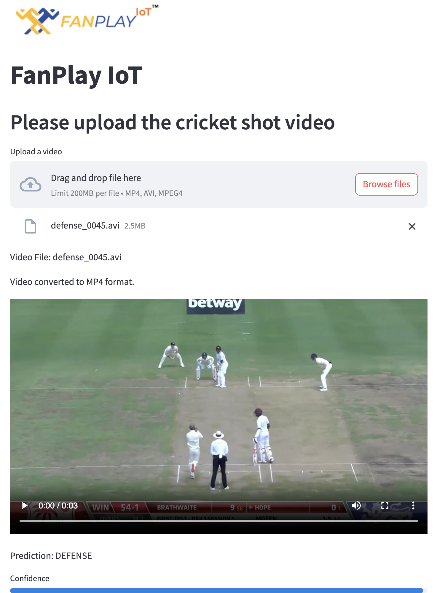

# CricShot_Predictor

For running this repo you have to install the ffmpeg. 

## Required library:
``` python
Pillow
torch
transformers
streamlit
scikit-learn
tqdm
numpy
shutil
requests
zipfile
```

```python
ModuleNotFoundError: No module named "Module Name" 
```
If the error still insist, then please install the required libraries

# To run files
[COMMAND]: for running cricket.ipynb
```python
jupyter notebook cricket.ipynb
```

[COMMAND]: for running fanplayiot.py
```python
streamlit run fanplayiot.py
```

# Interface



The code is compatible to run on cpu as well as on gpu.

Thanks to [Anik Sen](https://github.com/ascuet/cricshot10) for providing dataset.
